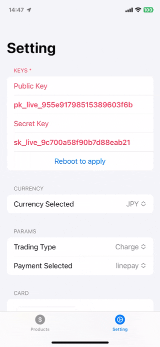

# Elepay Example App

| Charge | Source | Checkout |
|-------|-------|-------|
|  |  |  |

## elepay-ios-sdk （日本語）

**elepay iOS SDK** は elepay を iOS アプリに導入するための SDK です。
具体的な導入ガイドは以下の URLでご確認ください。  
[→ elepay iOS SDK 導入ガイド](https://developer.elepay.io/docs/ios-sdk)

## Example について

### 対応バージョン

* 開発環境：Xcode 15 以降

### テストについて

1. まず、setting ページで keys を設定する必要があります。keys は [dashboard](https://dashboard.elepay.io) で見つけることができます。
2. 異なる支払いチャネルからのリダイレクト用に `Url Scheme` を設定する必要があります。参照 [→ Guide for elepay iOS SDK](https://developer.elepay.io/docs/ios-sdk)

 > **ご注意：** 本番環境の「秘密鍵」は必ずサーバーで保存してください。App に保存すると、セキュリティーリスクになるため、絶対しないでください。

## elepay-ios-sdk (English)

**elepay iOS SDK** is made for your iOS Apps to easily import elepay multi-payment platform. For more details, please access the link below.  
[→ Guide for elepay iOS SDK](https://developer.elepay.io/docs/ios-sdk)

## About Elepay Example App

### Version Informations

* Xcode 15 and above

### How to test

1. First, set the keys on the settings page. The keys can be found in the [dashboard](https://dashboard.elepay.io).
2. Set up the `Url Scheme` for redirection with different payment channels. Refer to the [→ Guide for elepay iOS SDK](https://developer.elepay.io/docs/ios-sdk).

> **WARNING:** you should **NEVER** save "Secret Key" in your App for security reason.
